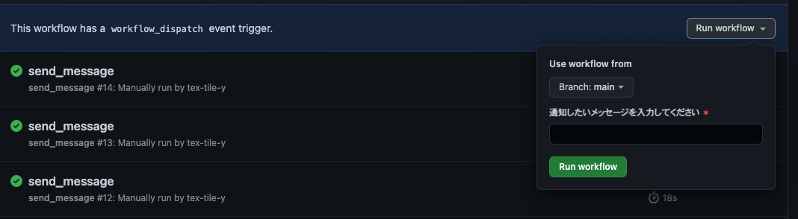

# discord

Discord関連のソース
<!--  -->
## voice_notification

ボイスチャンネルへの入退室をトリガーとしてテキストチャンネルへ通知するBOT

### [Botアカウントの設定手順](https://discordpy.readthedocs.io/ja/latest/discord.html)

#### 作成

Discordの[Applications](https://discord.com/developers/applications)ページを開き、画面右上`New Application`を開く。
任意の`NAME`と`APP ICON`を設定する。(後からいつでも変更可能)

画面左側`BOT`タブへ移り、`Build-A-Bot` > `Add Bot`をクリック > `Yes, do it!`をクリックしてBotを作成する。
遷移先の画面`USERNAME`の下の`TOKEN`を`Copy`して控えておく。

#### Botの設定

##### Privileged Gateway Intents

以下をONにする。

- [x] PRESENCE INTENT
- [x] SERVER MEMBERS INTENT
- [x] MESSAGE CONTENT INTENT

##### Bot Permissions

- [x] Send Messages

#### OAuth2タブ

##### URL Generator

`scopes`で以下をチェック。

- [x] bot

GENERATED URLをブラウザで開き、開いた画面でBotを追加したいDiscordサーバを選択する。
「認証しました」と表示されたらBotの追加は完了。

##### 他ユーザーをTesterとして招待

画面左側 [**🙋 App Testers**]タブより、開発に関わる別のユーザーを`INVITE`する。

### ローカル環境で稼働させるには

`.env`に、稼働させるBotトークン・通知させるチャンネルID・監視するボイスチャンネルIDをそれぞれ記載する。

### デプロイ

[【GitHub Actions】.envファイルを使用する](https://zenn.dev/big_tanukiudon/articles/fc1a2ff562ce3d)

### 設定値の更新

[Settings](https://github.com/T-School/discord/settings) > [Actions secrets and variables](https://github.com/T-School/discord/settings/secrets/actions)にて、**Repository secrets** と **Repository variables** を新しい設定値で更新する。

#### Repository secrets

機密情報などはこちらに設定する。実行結果で `'***'` のように値がマスクされる。入力値は上書きのみで、現在の値を参照・編集することはできない。

| key                | value                                 |
| ------------------ | ------------------------------------- |
| MESSAGE_CHANNEL_ID | Botがメッセージを通知するチャンネルID |
| TOKEN              | 稼働させるBotのトークン               |
| VOICE_CHANNEL_ID   | 監視対象のボイスチャンネルID          |

チャンネルIDの調べ方は「[ユーザー/サーバー/メッセージIDはどこで見つけられる？](https://support.discord.com/hc/ja/articles/206346498)」

#### [Repository variables](https://github.com/T-School/discord/settings/variables/actions)

機密ではない値はこちらに設定する。現在の入力値を参照・編集できる。

| key                  | value                                                                                                                               |
| -------------------- | ----------------------------------------------------------------------------------------------------------------------------------- |
| ACTIONS_RUNNER_DEBUG | `true`でRunnerの実行ログを出力する。                                                                                                |
| ACTIONS_STEP_DEBUG   | `true`でStepごとの実行ログを出力する。                                                                                              |
| ERROR_MESSAGE        | workflowがエラーを起こした際に、チャンネルに投稿するエラーメッセージ。                                                              |
| TIMEOUT_SECONDS      | `voice_notification`の実行を停止させる時間(秒)。21,580秒では「6時間を超える実行」のためエラーが発生するのでそれ以下の秒数を入れる。 |

### 定期実行を停止させるには

`voice_notification.yml`の `schedule:` と `- cron:`の2行をコメントアウトして `main`ブランチにpushする。

## send_message

Botに任意のメッセージを送らせるworkflow。
[Actions](https://github.com/T-School/discord/actions/workflows/send_message.yml) > `Run workflow`を開き、送信したいメッセージを入力して `Run workflow`を押す。

